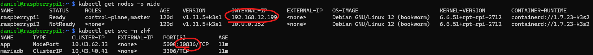

# 🏡 Zillow Housing Forecast

A containerized Python Flask web application that predicts the estimated one-year percent change in home values for any given ZIP code in the U.S.

---

## 🔍 About

This project uses historical Zillow data to forecast housing market trends. The app is built with Python and Flask, backed by a MariaDB database, and can be deployed in various environments using Docker Compose, Kubernetes, or AWS ECS Fargate.

## 🧱 Architecture

- **Frontend**: Multi-arch Python Flask app
- **Backend**: MariaDB with PersistentVolume
- **Namespace**: `zhf`
- **Storage**: Local PVC

## 📋 Prerequisites

- Kubernetes 1.24+
- kubectl configured
- (Optional) K3s / Minikube / Kind / GKE / EKS
- (Optional) MetalLB installed (if using `LoadBalancer` in local cluster)

## 🚀 Kubernetes Deployment Instructions

### Step 1: Clone this repo
```bash
git clone https://github.com/dstanecki/zillow-housing-forecast.git
cd zillow-housing-forecast
```
### Step 2: Create the 'zhf' namespace
```bash
kubectl apply -f deployments/kubernetes/namespace.yaml
```
### Step 3: Deploy all manifests
```bash
kubectl apply -f deployments/kubernetes/ -n zhf
```
### Step 4: Access the app via NodePort service or LoadBalancer (if configured)
#### NodePort 


Based on my example above, the link would be http://192.168.12.199:30836
